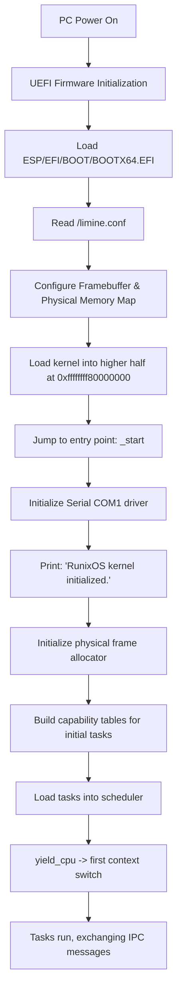

# RunixOS Kernel Architecture

RunixOS is an experimental, memory-safe, x86_64 capability-based microkernel written in Rust. The kernel is minimal: it provides memory management, scheduling, IPC, and a capability system. All other operating system abstractions (drivers, filesystems, logging, and services) are implemented as separate tasks.

---

## 1. System Boot Flow

RunixOS boots on x86_64 hardware via UEFI using the Limine Boot Protocol.



The bootloader Limine 7.13.3 requires base revision 2, which the kernel pins via `BaseRevision::with_revision(2)`. A mismatched revision halts the boot sequence immediately.

---

## 2. Memory Map & Higher-Half Layout

The kernel is linked at `0xffffffff80000000` (the top 2 GiB of the 64-bit virtual address space), separating kernel addresses from user-space addresses in the lower half. Limine provides a higher-half direct map (HHDM) offset to access physical frames.

```
+----------------------------------+ 0xffffffffffffffff (Top of memory)
|      Kernel Stack & Data         |
+----------------------------------+
|      Kernel Code & Read-Only     | Link Address: 0xffffffff80000000
+----------------------------------+
|                                  |
|      (Unmapped/Reserved)         |
|                                  |
+----------------------------------+ 0x0000800000000000 (End of canonical lower-half)
|                                  |
|   Per-task User Address Space    | (Strict per-task memory isolation)
|                                  |
+----------------------------------+ 0x0000000000000000
```

---

## Subsystem Details

### 1. Boot and Platform Bring-up
- **Purpose:** Manages UEFI and Limine boot handoff, sets up the Global Descriptor Table (GDT) and Task State Segment (TSS), and coordinates kernel initialization.
- **Key Types and Data Structures:** `BaseRevision` (in `kernel/boot/main.rs`), GDT and TSS configuration (in `kernel/arch/x86_64/gdt.rs`).
- **Interfaces:** `kernel_main` (the primary kernel entry point called by assembly bootstrap) and `gdt::init` (to load GDT descriptors and TSS selectors).
- **Invariants:** Initialization proceeds sequentially; no scheduling or interrupts are enabled until the core GDT, TSS, memory, and task structures are initialized.
- **Findings and Tradeoffs:** The bootloader base revision must be pinned to 2. Mismatched revisions prevent Limine from mapping memory descriptors, causing immediate halt.

### 2. Memory Management
- **Purpose:** Manages physical memory allocation, virtual memory mapping, per-task page tables, and user-space buffer safety validation.
- **Key Types and Data Structures:** `FrameAllocator` (bump-allocation frame manager in `kernel/memory/mod.rs`) and PML4 page directory structures.
- **Interfaces:** `memory::alloc_frame` (allocate a physical frame), `memory::map_page` (bind a virtual address to a physical address), and `memory::validate_user_range` (validate user-supplied pointer ranges).
- **Invariants:** Every user address range passed to a system call must reside in the lower half of the canonical address space and have active, present page translations.
- **Findings and Tradeoffs:** Dynamic page table traversal is necessary in `validate_user_range` to prevent ring-3 user code from triggering kernel page faults by passing invalid pointers to the kernel.

### 3. Capability System
- **Purpose:** Restricts access to system resources via unforgeable, kernel-issued tokens, supporting rights attenuation, sealing, and transitive revocation.
- **Key Types and Data Structures:** `Resource`, `Capability` (in `kernel/process/capability.rs`), `CapTable` (the task-local capability storage), and `AUDIT_LOG` (the kernel audit trail in `kernel/process/audit.rs`).
- **Interfaces:** `CapTable::insert` (store a capability and stamp a unique ID), `CapTable::remove` (discard a capability), `CapTable::kernel_revoke` (forcibly wipe a capability), `Capability::attenuate` (intersect rights), and `propagate_revocation` (transitively revoke derived capabilities).
- **Invariants:** Capability IDs are globally unique and never recycled. A sealed capability cannot be removed by its holder task. Attenuated capabilities can only possess a subset of their parent rights.
- **Findings and Tradeoffs:** Revocation propagation is implemented as a fixpoint iteration over all active task capability tables. Using unique IDs instead of `(task, slot)` pairs prevents lineage tracking errors when slots are reused.

### 4. Task Model and Scheduler
- **Purpose:** Defines the task execution context and coordinates task selection and context switching.
- **Key Types and Data Structures:** `Task` (in `kernel/process/mod.rs`), `TaskId`, `TaskState` (Ready, Running, BlockedOnReceive, BlockedOnSend, Terminated), and `SCHEDULER` (in `kernel/scheduler/mod.rs`).
- **Interfaces:** `scheduler::yield_cpu` (relinquish processor to next ready task), `scheduler::terminate_current_task` (terminate task execution), and `switch_context` (low-level register swap).
- **Invariants:** The active task must correspond to the scheduler's running state, and task state changes must be synchronized under the global scheduler lock.
- **Findings and Tradeoffs:** Cooperative scheduling simplifies kernel design because state transitions are atomic, but it is vulnerable to infinite loops in compute-bound tasks. This necessitated the integration of timer-driven preemption.

### 5. Preemption
- **Purpose:** Drives involuntary task preemption using timer interrupts and manages non-preemptible critical sections.
- **Key Types and Data Structures:** `CriticalWindow` (in `kernel/preempt/mod.rs`), which increments the preemption disable count, and `preempt::stats` (execution telemetry).
- **Interfaces:** `preempt::set_armed` (enable or disable timer-driven preemption) and `preempt::stats` (query ticks and preemption events).
- **Invariants:** The IPC send path validates and uses capabilities inside a single, continuous non-preemptible critical section.
- **Findings and Tradeoffs:**
  Under cooperative scheduling, the sequence of validating a capability and then using it was atomic because no other task could run in between. The introduction of timer-driven preemption removed this guarantee: a timer tick could land between validation and use, allowing a concurrent task to revoke the capability before it was actually accessed.
  The vulnerability was confirmed by creating a deterministic adversary that revokes a capability exactly inside this window. The solution enforces atomicity by wrapping the validate-and-use sequence in a `CriticalWindow` guard. This increments the preemption disable count, deferring timer-driven context switches until the guard is dropped.

### 6. Interrupts and Fault Containment
- **Purpose:** Configures the Interrupt Descriptor Table (IDT), catches CPU exceptions, handles hardware timer/keyboard IRQs, and isolates faults.
- **Key Types and Data Structures:** IDT gate descriptors and the `ExceptionFrame` struct (in `kernel/interrupts/mod.rs`).
- **Interfaces:** `interrupts::init_idt` (load IDT pointer) and CPU exception entry points.
- **Invariants:** A CPU exception (such as a page fault or invalid opcode) in user space terminates the offending task without panicking the microkernel.
- **Findings and Tradeoffs:** Register state capture in `ExceptionFrame` allows the kernel to print diagnostic crash logs for developers while cleanly terminating the faulting task, preserving the execution of other tasks.

### 7. IPC
- **Purpose:** Implements synchronous rendezvous and asynchronous queued message passing between tasks.
- **Key Types and Data Structures:** `Message`, `IpcTag` (in `kernel/process/ipc.rs`), `IpcError`, and `MessageQueue` (backing asynchronous mailboxes).
- **Interfaces:** `sys_send_typed` (transmit a message) and `sys_receive_typed` (receive a message).
- **Invariants:** Message payloads are copied directly between task memory spaces under the scheduler lock, preventing shared-memory consistency issues.
- **Findings and Tradeoffs:** Senders blocked on a target task must be woken up with a `TargetGone` error if the target terminates, preventing deadlock. Bounded queues enforce backpressure by returning `QueueFull` to senders.

### 8. Syscall Surface
- **Purpose:** Decodes incoming software interrupts (`int 0x80`) and dispatches them to capability-checked kernel functions.
- **Key Types and Data Structures:** `KernelRequest` and `SyscallFrame` (in `kernel/syscall/mod.rs`).
- **Interfaces:** `syscall_dispatch` (route decoded requests).
- **Invariants:** Every system call must parse raw registers into a typed `KernelRequest` and validate the required capability index before execution.
- **Findings and Tradeoffs:** Centralizing deserialization in the syscall wrapper ensures that memory range checks and capability validation are performed uniformly before calling core kernel logic.

### 9. Interactive Console
- **Purpose:** Provides a capability-checked shell over serial I/O for debugging and research demonstrations.
- **Key Types and Data Structures:** Console task (in `kernel/shell/mod.rs`) and COM1 serial driver (in `kernel/drivers/serial.rs`).
- **Interfaces:** `shell::run_console` (interactive command loop).
- **Invariants:** The console must validate that it holds the appropriate capabilities (such as filesystem or device access) before executing commands.
- **Findings and Tradeoffs:** Because the console runs as a ring-0 service, it has direct access to kernel structures. However, it operates under the same capability checks as user space, proving the model's viability.

### 10. Persistence
- **Purpose:** Captures and restores task metadata and capability tables in memory.
- **Key Types and Data Structures:** `SystemSnapshot` and `TaskCheckpoint` (in `kernel/process/snapshot.rs`).
- **Interfaces:** `snapshot::capture` (checkpoint task tables and states) and `snapshot::restore` (rollback task tables and states).
- **Invariants:** Restoring task state must verify the integrity checksum of the snapshot and preserve the active scheduler execution context.
- **Findings and Tradeoffs:**
  *Honest Boundary:* The persistence system is currently in-memory only. Cross-reboot durability and live stack serialization are out of scope because the kernel lacks storage block drivers and stack-relocation logic.

### 11. Distribution Substrate
- **Purpose:** Routes IPC messages location-transparently and coordinates service migration.
- **Key Types and Data Structures:** `ServiceRegistry` and `Location` (in `kernel/process/dist.rs`).
- **Interfaces:** `dist::demo` (migration showcase) and `dist::route_send` (route message based on location).
- **Invariants:** Senders address services using abstract `Service` capabilities, remaining unaware of whether the service is local or remote.
- **Findings and Tradeoffs:**
  *Honest Boundary:* There is no physical network interface. Remote nodes are simulated logical domains within the kernel image, and transport is handled via in-kernel queues. This seam allows adding physical drivers later without modifying the routing layer.

### 12. Filesystem Service
- **Purpose:** Provides a hierarchical directory and file structure, gated by capabilities.
- **Key Types and Data Structures:** `Resource::FsNode` (in `kernel/process/capability.rs`) and the filesystem task (in `kernel/shell/mod.rs`).
- **Interfaces:** IPC-based file system requests (mkdir, write, read, ls, delete, stat).
- **Invariants:** All directory and file operations require a valid `FsNode` capability with matching read/write rights.
- **Findings and Tradeoffs:** The service runs in ring 0 to simplify system bootstrap, but it is strictly isolated from callers by capability-gated IPC interfaces.

### 13. Device Abstraction Subsystem
- **Purpose:** Exposes hardware devices (serial and keyboard) through unified capability-gated interfaces.
- **Key Types and Data Structures:** `Resource::Device` (in `kernel/process/capability.rs`) and the device task (in `kernel/shell/mod.rs`).
- **Interfaces:** IPC-based read and write operations.
- **Invariants:** Calling tasks must hold a `Device` capability for the target hardware identifier.
- **Findings and Tradeoffs:** Abstracting hardware behind IPC channels decouples user code from low-level port I/O registers.

### 14. Synchronization Service
- **Purpose:** Implements mutexes and semaphores using deferred-reply blocking over IPC.
- **Key Types and Data Structures:** `Resource::SyncObj` (in `kernel/process/capability.rs`) and the synchronization task (in `kernel/shell/mod.rs`).
- **Interfaces:** IPC-based create, acquire, and release operations.
- **Invariants:** Attempting to acquire an unavailable sync object blocks the caller task without sending an IPC reply, deferring the reply until a release occurs.
- **Findings and Tradeoffs:** Deferred replies allow tasks to block on synchronization objects without consuming CPU cycles in busy-wait loops.

### 15. Architecture Simulation Toolkit
- **Purpose:** Simulates CPU caches and pipeline execution statistics using real kernel trace buffers.
- **Key Types and Data Structures:** `CacheSim` (set-associative cache state) and `PipelineSim` (hazard detection state in `kernel/arch_sim/mod.rs`).
- **Interfaces:** `arch cache-sim` and `arch pipeline-sim` shell commands.
- **Invariants:** The simulator must reset its internal state before processing a trace stream.
- **Findings and Tradeoffs:** Deriving addresses using locality-preserving operations (instead of random hashes) is required to accurately demonstrate changes in cache hit rates across varying set associativities.

### 16. SMP
- **Purpose:** Bootstraps multiple CPU cores, sends Inter-Processor Interrupts (IPIs), and manages local APICs.
- **Key Types and Data Structures:** APIC register maps (in `kernel/arch/x86_64/apic.rs`) and SMP CPU state tables.
- **Interfaces:** `init_smp` (startup AP cores) and `smp::send_ipi` (send an interrupt to a target core).
- **Invariants:** Application Processors (APs) boot using UEFI Hand-off protocols and wait in a spin loop for incoming IPIs.
- **Findings and Tradeoffs:** Operating with multiple cores requires proper synchronization on shared serial devices and interrupt routing, which is achieved using the local APIC.
