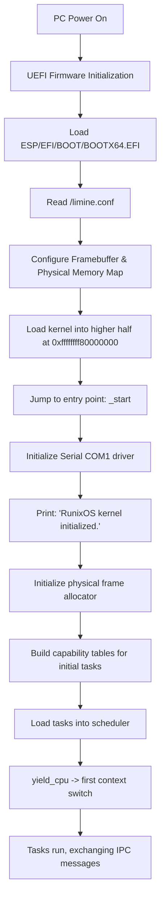

# RunixOS Kernel Architecture

RunixOS is an experimental, memory-safe, x86_64 **capability-based microkernel** written in
Rust. The kernel is deliberately minimal: it provides memory management, scheduling, IPC, and
a capability system, and nothing else. All OS abstractions -- drivers, filesystem, logging,
init -- belong in user space.

See [`../../OS_PLAN.md`](../../OS_PLAN.md) for the full phase-by-phase directive.

---

## 1. Design Principles (non-negotiable)

- **IPC-first.** Message passing is the *only* communication mechanism. No shared memory
  between processes.
- **Capability-gated.** There is no ambient authority. Every kernel operation requires a
  valid, unforgeable, kernel-issued capability. No global registries or hidden state.
- **Minimal kernel.** The kernel implements only: physical memory manager, virtual memory
  manager, round-robin scheduler, IPC, and the capability system.
- **User-space services.** Drivers, filesystem, logging, and init are processes that
  communicate via IPC. They are *not* part of the kernel.
- **Not Unix.** No POSIX layer, no `fork`/`exec` semantics, no traditional syscall model.

When in doubt: choose the simplest correct implementation, prefer decomposition over
centralization, and prefer capability enforcement over convenience.

---

## 2. System Boot Flow (UEFI + Limine)

RunixOS boots on x86_64 hardware via UEFI using the **Limine Boot Protocol**.



> **Base revision note:** the `limine` crate requests its maximum supported base revision by
> default. The bundled bootloader (Limine 7.13.3) only acknowledges base revision 2, so the
> kernel pins `BaseRevision::with_revision(2)`. With a mismatched revision the bootloader
> never marks the request as supported and the kernel halts immediately after printing its
> init message.

---

## 3. Memory Map & Higher-Half Layout

The kernel is linked at `0xffffffff80000000` (the top 2 GiB of the 64-bit virtual address
space), separating kernel addresses from user-space addresses (lower half). Limine provides a
HHDM (higher-half direct map) offset used by the virtual memory mapper to access physical
frames.

```
+----------------------------------+ 0xffffffffffffffff (Top of memory)
|      Kernel Stack & Data         |
+----------------------------------+
|      Kernel Code & Read-Only     | Link Address: 0xffffffff80000000
+----------------------------------+
|                                  |
|      (Unmapped/Reserved)         |
|                                  |
+----------------------------------+ 0x0000800000000000 (End of canonical lower-half)
|                                  |
|   Per-process User Address Space | (Phase 2+: strict per-process isolation)
|                                  |
+----------------------------------+ 0x0000000000000000
```

---

## 4. Kernel Primitives (Phase 1)

The kernel contains only the following subsystems. Everything else is deferred to user space.

### 4.1 Capability System (`process/capability.rs`)

Capabilities are the central security primitive -- opaque, unforgeable, kernel-issued tokens
that bind a holder to a specific resource and a set of rights.

- `Resource` -- what a capability refers to: `Serial`, `IpcChannel { target_task }`,
  `MemoryMapping { start_vaddr, size, writeable }`.
- `Capability` -- a `Resource` plus `read` / `write` / `grant` rights.
- `CapTable` -- a fixed-size, per-process table of capability slots (no dynamic allocation in
  Phase 1). Operations: `insert`, `get`, `remove` (revoke).

Rules enforced:

- All kernel APIs validate a capability before acting.
- No ambient authority -- a task can only act through capabilities it holds.
- Capabilities are referenced by slot index within the holder's own table; a task cannot
  forge or reach another task's slots.

### 4.2 IPC (`process/ipc.rs`)

Message passing is the only communication mechanism. Phase 1 uses **blocking rendezvous** IPC.

- `sys_send(cap_idx, payload)` -- resolves the target task from an `IpcChannel` capability,
  then either delivers immediately (if the target is blocked on receive) or blocks the sender
  until the target receives.
- `sys_receive()` -- delivers a waiting sender's message, or blocks until one arrives.
- `Message` -- `{ sender: TaskId, payload: [u8; 128], len }`. Fixed-size payload; no shared
  buffers.

There is no shared memory: the message is copied between task buffers under the scheduler
lock.

### 4.3 Scheduler (`scheduler/mod.rs`)

A cooperative round-robin scheduler over a fixed task array.

- `yield_cpu()` selects the next `Ready` task round-robin and performs a context switch.
- `switch_context` (inline asm in `process/mod.rs`) saves/restores callee-saved registers and
  swaps stack pointers.
- Task stacks are statically allocated (`TASK_STACKS`) to avoid a heap in Phase 1.

Scheduling is cooperative for now; preemption requires the timer interrupt that arrives with
Phase 1 fault-isolation / IDT work.

### 4.4 Memory Management (`memory/mod.rs`)

- **Physical:** `FrameAllocator` bump-allocates 4 KiB frames from the largest usable region of
  the Limine memory map.
- **Virtual:** `map_page(vaddr, paddr, writeable)` walks/creates the 4-level page tables via
  the HHDM offset and flushes the TLB with `invlpg`.

### 4.5 Capability-gated kernel entry points (`syscall/mod.rs`)

A transitional surface for capability-checked kernel actions. `sys_serial_write(cap_idx, msg)`
writes to COM1 only if the caller holds a `Resource::Serial` capability at that slot. In later
phases this role moves to user-space services reached purely over IPC.

---

## 5. Process Model

A task (`process::Task`) is the minimal process abstraction:

- a kernel stack and saved stack pointer (`rsp`),
- a per-process capability table,
- a single-slot IPC buffer and a `TaskState`
  (`Ready` / `Running` / `BlockedOnReceive` / `BlockedOnSend` / `Terminated`).

There are no Unix process semantics. A task acquires authority solely through the capabilities
placed in its table at creation; it cannot obtain new authority except by being granted a
capability.

---

## 6. Module Map

| Path | Role | Status |
|------|------|--------|
| `boot/` | Entry point (`_start`), Limine requests, initial task wiring | active |
| `memory/` | Frame allocator, VM mapper, per-process address spaces | active |
| `process/capability.rs` | Capability + CapTable; sealing, rights attenuation, grant | active |
| `process/ipc.rs` | Rendezvous + async IPC; structured `Message` with `IpcTag` + `IpcError` | active |
| `process/audit.rs` | Kernel-only capability grant/revoke audit ring buffer | active |
| `process/snapshot.rs` | System checkpoint/restore; persistent capability graph | active |
| `process/dist.rs` | Distribution substrate: location-transparent routing, migration, failover | active |
| `process/mod.rs` | Task, IPC-buffer, re-exports | active |
| `scheduler/` | Cooperative round-robin scheduler; CR3 + rsp0 switch | active |
| `syscall/` | `KernelRequest` typed dispatch; `SYS_CAP_GRANT`, `SYS_SEND_TYPED` | active |
| `drivers/` | Boot-essential drivers only -- COM1 serial | active |
| `arch/x86_64/` | GDT + TSS (kernel/user segments, rsp0) | active |
| `interrupts/` | IDT + CPU-exception handlers (fault containment) | active |
| `userspace/` | Ring-3 program setup (address space + program load) | active |
| `fs/` | Filesystem -- **belongs in user space** (Phase 6) | reserved |
| `tests/` | Kernel integration tests | stub |

The `fs/` directory exists only as a reserved namespace. Per the directive, the kernel must
**not** implement filesystem, driver, or service logic -- these are user-space processes
reached over IPC.

---

## 8. User Space (Phase 2)

Phase 2 moves service logic into ring 3. The kernel becomes a coordination layer: it provides
capabilities, routes IPC, and performs privileged actions only on behalf of a capability
holder.

- **Privilege separation.** `arch/x86_64/gdt.rs` installs kernel and user segments plus a TSS.
  Each task owns a kernel stack; the scheduler loads the incoming task's stack into `TSS.rsp0`
  on every switch, so a ring 3 -> ring 0 transition lands on that task's own kernel stack.
- **Per-process address spaces.** `memory::new_address_space` allocates a fresh PML4 and copies
  the kernel's higher half (entries 256..512) so the kernel stays mapped; the lower half holds
  the process's private user pages. The scheduler loads each task's `cr3` on switch, giving
  true isolation -- two user tasks can use identical virtual addresses without collision.
- **Ring-3 entry.** `Task::new_user` primes a kernel stack with a CPU interrupt frame; the first
  context switch returns into the `iret_to_user` trampoline, whose `iretq` drops to ring 3.
- **IPC-based syscalls.** There is no Unix syscall model. The `int 0x80` trap (a DPL-3 IDT gate)
  is purely transport: a naked stub saves registers and calls `syscall_dispatch`, which handles
  `send` / `receive` / `serial_write` / `yield`. Every request is checked against the caller's
  capabilities; `serial_write` requires a `Serial` capability.
- **A user-space service.** The logging service (`userspace/mod.rs`) runs entirely in ring 3: it
  `receive`s IPC into its own memory and prints via the capability-gated `serial_write` syscall.
  A kernel task and a ring-3 user task both send it messages; the kernel only routes them and
  enforces the service's serial capability.

This satisfies the Phase 2 success criteria: the kernel contains only core primitives, a
user-space service runs, IPC flows between the kernel and user space, and no filesystem or
driver logic lives in the kernel (the serial port is the one boot-essential primitive, mediated
by capability).

---

## 7. Phase 1 Demonstration

The current boot wires up two tasks to exercise the primitives end to end:

1. **Task 1 (sender)** holds an `IpcChannel` capability targeting Task 2. It sends
   `"Sensor data: Temp=24.5C"` each iteration. It also *attempts* a serial write through a
   capability slot it does not own -- which the kernel rejects, demonstrating capability
   gating.
2. **Task 2 (logging service)** holds a `Serial` capability. It receives the IPC message and
   prints it through its serial capability.

3. **Task 3 (buggy)** holds no capabilities and deliberately performs an illegal memory
   access. The IDT exception handler catches the fault, terminates only Task 3, and
   reschedules -- Tasks 1 and 2 continue uninterrupted. This demonstrates fault containment.

This satisfies the Phase 1 success criteria: the kernel boots, multiple tasks run, IPC passes
between them, capability gating blocks unauthorized access, and a process fault does not crash
the kernel.

## 9. Phase 3: System Coherence

Phase 3 hardens the capability model and IPC without adding new kernel primitives.

### 9.1 Capability sealing (`process/capability.rs`)

- `Capability::sealed` -- when set, `CapTable::remove()` returns `Err(())`; the holder
  cannot discard a mandatory authority the kernel placed. `CapTable::kernel_revoke` is the
  privileged path that bypasses the seal.
- `CapTable::insert_sealed` -- inserts a capability and immediately sets `sealed = true`.
  Used by the kernel when constructing a task's initial capability set.

### 9.2 Rights attenuation (`process/capability.rs`)

- `Capability::attenuate(RightsMask)` -- returns a derived capability whose rights are the
  *intersection* of the donor's rights and the requested mask. Fails with `Err(())` if the
  donor lacks the `grant` flag. Derived caps are never sealed (the kernel seals at
  task-creation time).

### 9.3 Structured IPC (`process/ipc.rs`)

- `IpcTag` enum (`Raw`, `Log`, `Sensor`, `Ping`) -- a kernel-visible discriminant on every
  message. `IpcTag::from_u16` rejects unknown variants.
- `Message` gains `tag: IpcTag` and `version: u16`; the raw payload remains `[u8; 128]`.
- `IpcError` enum replaces `()` so callers can distinguish `NoCapability` / `TargetGone` /
  `InvalidTag` / `BadVersion` / `PayloadTooLarge` / `NoContext`.
- `sys_send_typed` / `sys_receive_typed` are the new kernel-mode typed paths; the old
  `sys_send` / `sys_receive` are shims wrapping them as `IpcTag::Raw` for Phase 2 compat.

### 9.4 Kernel dispatch layer (`syscall/mod.rs`)

- `KernelRequest` -- an enum built from the raw `SyscallFrame` by `parse_request`. The
  `syscall_dispatch` match arm for each variant receives already-typed inputs (no ad-hoc
  `if len <= 128 && !ptr.is_null()` checks scattered through the dispatcher).
- `SYS_CAP_GRANT` (5) -- `dispatch_cap_grant` atomically: (1) resolves the donor cap and
  calls `attenuate`, (2) inserts the derived cap into the target task's table. Rights
  attenuation and the grant-flag check happen in the same kernel lock section.
- `SYS_SEND_TYPED` (6) -- calls `sys_send_typed`; the kernel rejects unknown tags and the
  reserved version sentinel `0xFFFF` before forwarding.

### 9.5 Phase 4: Isolation & Safety Hardening

Phase 4 hardens the microkernel boundaries and enforces safety guarantees:

- **Strict memory isolation (`memory/mod.rs`)** -- The `validate_user_range(ptr, len, writeable)` function traverses all four levels of the active PML4 page tables. It ensures that every page in a user-supplied buffer is mapped, resides in user space (U/S bit set), and has correct read/write permissions.
- **Fault containment (`interrupts/mod.rs`)** -- Custom assembly entries (`divide_error_entry`, `invalid_opcode_entry`, `general_protection_entry`, `page_fault_entry`) intercept CPU exceptions. They save the entire task register context (general-purpose + CPU interrupt frame registers) into `ExceptionFrame`, print it for debugging, save it to the terminated task's metadata, and hand control back to the scheduler.
- **`SYS_CAP_REVOKE` (7)** -- Gated capability revocation API. Allows a task to revoke a capability from a target task's table, bypassing any sealing checks. The caller must hold a capability to the target task with `grant = true`.

**Next:** Phase 5 introduces async/non-blocking IPC, message queues, and a kernel dispatch queue to scale system communication to larger numbers of tasks.

## 10. Phase 7: Stress, Scale & Failure Testing

Phase 7 validates the system under pressure rather than ideal conditions, and
hardens IPC failure semantics.

### 10.1 Failure semantics (`process/ipc.rs`, `scheduler/mod.rs`)

- **Dead targets never deadlock.** `sys_send_typed`'s rendezvous loop now checks
  for `TaskState::Terminated` on the target and returns `IpcError::TargetGone`
  immediately instead of blocking forever on a channel that can never complete.
- **Senders are woken on target death.** When `terminate_current_task` runs
  (fault *or* voluntary exit), it scans for any task in
  `BlockedOnSend(dead_id)` and marks it `Ready`; on resume that sender observes
  the target is gone and returns `TargetGone`. This contains broken IPC channels.

### 10.2 Backpressure

Async IPC has a bounded per-task `MessageQueue` (`MSG_QUEUE_CAPACITY`). On a full
queue, `sys_send_async` returns `IpcError::QueueFull` (surfaced to ring 3 as the
sentinel `u64::MAX - 7`); the sender chooses to retry or yield. The backpressure
policy is therefore explicit **blocking-or-drop at the caller's discretion**, not
silent loss.

### 10.3 Kernel stress/failure harness (`boot/main.rs`)

A set of ring-0 kernel tasks runs alongside the user-space ecosystem to exercise
the criteria at runtime:

- `task_crasher` performs an illegal access; the IDT handler terminates only it
  and the kernel continues (fault containment).
- `task_dead_target` exits immediately; `task_probe` then sends to it and must
  observe `TargetGone` (failure semantics).
- 16 `task_worker`s churn the scheduler and exit cleanly (scale / stability).

A normal boot shows the crasher contained, the probe reporting `TargetGone`, all
workers exiting cleanly, and **zero kernel panics** -- satisfying the Phase 7
success criteria.

## 11. Phase 8: Security & Capability Maturity

Phase 8 turns capabilities into a full security model with an audit trail and
transitive revocation.

### 11.1 Capability audit log (`process/audit.rs`)

The kernel keeps an append-only, fixed-capacity ring buffer (`AUDIT_LOG`) of
every capability lifecycle event: `Grant`, `Revoke`, and `RevokePropagated`.
Each `AuditEvent` records the actor (granter/revoker, or `kernel`), the target
task, the resource, and the slot. It is **kernel-only** -- no syscall exposes it
to ring 3. Under sustained churn the ring overwrites the oldest entries and
counts how many were `dropped`, so it never allocates or grows unbounded.

### 11.2 Derivation lineage & revocation propagation

- `Capability::origin: Option<(TaskId, usize)>` records the donor `(task, slot)`
  a capability was derived from. Root capabilities the kernel mints have
  `origin = None`; `dispatch_cap_grant` stamps the donor's identity onto each
  derived capability.
- `propagate_revocation` (in `syscall/mod.rs`) walks the lineage: after a
  capability is revoked, it transitively `kernel_revoke`s every capability whose
  `origin` traces back to it, recording a `RevokePropagated` audit event for
  each. It runs under the scheduler lock with a fixed worklist (no allocation).

### 11.3 No ambient authority (unchanged, reaffirmed)

Every privileged kernel action still requires a capability the caller holds:
serial writes need a `Resource::Serial` cap; grants require the donor's `grant`
right and can only *attenuate* (intersect) rights; revocation requires a
grant-flagged capability to the target. There is no path to forge a capability
or reach another task's slots.

### 11.4 Demonstration (`syscall::phase8_security_demo`)

A boot-time kernel task builds a three-level chain `A → B → C` (each link a
derived capability), revokes A's root capability, and verifies B and C both lose
their derived capabilities -- then dumps the audit trail, which shows the four
real init grants plus the demo's grant/revoke/propagation events. This satisfies
the Phase 8 success criteria: the capability system is fully enforced, no ambient
authority exists, all access is capability-gated, and the audit trail is complete.

> **Lineage robustness note.** Capability lineage uses a globally-unique,
> never-recycled capability `id` (assigned by `CapTable::insert`), not
> `(task, slot)` -- so revocation propagation cannot mis-target a derived
> capability after a slot index is reused. Propagation is a fixpoint over the
> capability tables keyed by id, complete regardless of derivation fan-out.

## 12. Phase 9: System Stability & Self-Sufficiency

Phase 9 makes RunixOS self-sustaining: it recovers from service failure and
boots deterministically.

### 12.1 Watchdog & service recovery (`boot/main.rs`)

A kernel `task_watchdog` monitors a service task. When the service faults, the
IDT handler contains it and leaves it `Terminated`; the watchdog detects this,
restarts the service in the same slot with a **freshly granted capability set**
(capability redistribution on failure -- the dead incarnation's authority is
never inherited), and bounds restarts at `MAX_RESTARTS` so an unrecoverable
service cannot loop forever. Once a stable incarnation is observed running, the
watchdog declares recovery and exits.

The demo (`task_fragile_service`) crashes on its first two incarnations and runs
stably on the third; a normal boot shows: crash → restart #1 → crash → restart
#2 → stable → "service recovered." The kernel never panics throughout.

### 12.2 Deterministic boot

The boot path initializes in a fixed order -- serial, frame allocator, GDT/TSS,
IDT, then `init` plus the Phase 7/8/9 harnesses -- with no hidden initialization
paths. High-frequency diagnostics are gated behind the compile-time
[`DEBUG`](#) switch (see §Phase 6), so the boot log is identical run to run.

### 12.3 Failure containment recap

Across all harnesses a normal boot contains three deliberate faults (one crasher,
two service crashes) and reports `TargetGone` for the dead-target probe, with
**zero kernel panics** -- the kernel stays minimal and stable under every induced
failure, satisfying the Phase 9 success criteria.

## 13. Phase 10 (Parts 1–3): Persistence -- Checkpoint & Restore

Phase 10 is the "final boss": distributed, persistent RunixOS. This build
implements the **single-node, in-memory** core of it and is explicit about the
boundary.

### 13.1 What is implemented (`process/snapshot.rs`)

- **Part 1 -- persistent system state.** `capture()` serializes every task's
  checkpointable state -- capability table, pending IPC (rendezvous buffer +
  async queue), and metadata (id, state) -- plus the scheduler's current task,
  into a single fixed-size `SystemSnapshot` ("save-system-state"). `restore()`
  writes it back ("restore-system-state").
- **Part 2 -- process checkpointing.** The per-task projection (`TaskCheckpoint`)
  is exactly a checkpoint of a process's capability/IPC/metadata state.
- **Part 3 -- persistent capabilities.** Capabilities are POD carrying their
  globally-unique `id` and `origin` lineage, so the whole capability *graph*
  round-trips byte-for-byte. An FNV-1a integrity checksum over the graph
  (computed field-by-field, padding-free) stands in for the spec's "optional
  signing"; `restore()` refuses a snapshot whose checksum does not verify.

`restore()` deliberately preserves each live task's execution context
(`rsp`/`cr3`/`kstack_top`) and rolls back only the serialized metadata -- the
"functionally equivalent" state the spec asks for, without corrupting the stacks
of tasks that are still running.

### 13.2 Demonstration (`snapshot::demo`)

A boot-time kernel task checkpoints the system, simulates catastrophic state loss
by wiping the logging service's capability table, restores, and verifies the
service's capability graph (count **and** each cap's id + lineage) came back
intact, then re-captures to confirm the checksum is reproduced (deterministic
persistence). A normal boot prints the checkpoint, the simulated loss, the
restore count, and `PASS`.

### 13.3 Out of scope in this build (honest boundary)

- **Cross-*reboot* durability** (Part 1's `shutdown/reboot` step) needs a
  block-write driver (ATA PIO / virtio-blk); the kernel currently only *reads*
  the disk via Limine at boot.
- **Live register/stack capture-and-resume** (full live process migration).
- **Parts 4–8** (network-transparent IPC, distributed capabilities, service
  migration, distributed fault tolerance) need a NIC driver and a second node.

These are the natural next increments toward the full Phase 10 thesis.

## 14. Phase 10 (Parts 4–8): Distribution Substrate

Parts 4–8 add network-transparent IPC, distributed capabilities, service
migration, persistent migration, and failover -- at the **architecture** level.

> **Honest boundary.** There is no physical NIC in this build. A "remote node"
> is a logical domain inside the same kernel image and the `Transport` is an
> in-kernel queue. `dist::transport_send` is deliberately a narrow seam (serialize
> a message + hand it to a node) so a real virtio-net/e1000 backend could later
> implement it **without changing** the routing, capability, or migration logic
> above it. What is demonstrated is the routing/migration machinery and the
> programming-model invariance -- not wire I/O.

### 14.1 Location-transparent routing (`process/dist.rs`)

A `ServiceRegistry` maps `ServiceId → Location` (`Local(TaskId)` or
`Remote(NodeId)`). `route_send(cap, payload)` resolves the capability's service
id to its current location and delivers either to the local task's queue or, via
the transport, to the hosting node -- the caller never branches on location
(**Part 4**).

### 14.2 Distributed capabilities (**Part 5**)

A new `Resource::Service { id }` lets a capability name a *service*, not a task or
machine. Its location can change under migration while the capability (and its
`id`/`origin` lineage) stays valid.

### 14.3 Migration & persistent migration (**Parts 6–7**)

`migrate(svc, dest)` checkpoints the local task (reusing the Phase 10 Part 1–3
`TaskCheckpoint`), transfers that serialized state to the destination node,
restores it there, and atomically re-points the route to `Remote(dest)` -- then
tears down the local instance. The client's capability is untouched, and the
service's capabilities ride along (state preserved).

### 14.4 Failover (**Part 8**)

`failover(svc, replica)` recovers the last checkpoint held on a failed node,
restores it onto a local replica task, and re-binds the route to `Local(replica)`
-- so capability holders keep working after a node loss.

### 14.5 Demonstration (`dist::demo`)

A boot-time kernel task registers a service locally, sends to it transparently,
migrates it to node 1, sends to it again over the **same** capability (now routed
through the transport, client unaware), pumps the remote node to show the
messages arrived, verifies the migrated capability count was preserved, then
fails node 1 over to a local replica and confirms the capability still routes. A
normal boot prints `PASS` for both the migration and the failover.

