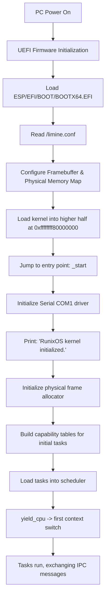

# RunixOS Kernel Architecture

RunixOS is an experimental, memory-safe, x86_64 **capability-based microkernel** written in
Rust. The kernel is deliberately minimal: it provides memory management, scheduling, IPC, and
a capability system, and nothing else. All OS abstractions — drivers, filesystem, logging,
init — belong in user space.

See [`../../OS_PLAN.md`](../../OS_PLAN.md) for the full phase-by-phase directive.

---

## 1. Design Principles (non-negotiable)

- **IPC-first.** Message passing is the *only* communication mechanism. No shared memory
  between processes.
- **Capability-gated.** There is no ambient authority. Every kernel operation requires a
  valid, unforgeable, kernel-issued capability. No global registries or hidden state.
- **Minimal kernel.** The kernel implements only: physical memory manager, virtual memory
  manager, round-robin scheduler, IPC, and the capability system.
- **User-space services.** Drivers, filesystem, logging, and init are processes that
  communicate via IPC. They are *not* part of the kernel.
- **Not Unix.** No POSIX layer, no `fork`/`exec` semantics, no traditional syscall model.

When in doubt: choose the simplest correct implementation, prefer decomposition over
centralization, and prefer capability enforcement over convenience.

---

## 2. System Boot Flow (UEFI + Limine)

RunixOS boots on x86_64 hardware via UEFI using the **Limine Boot Protocol**.



> **Base revision note:** the `limine` crate requests its maximum supported base revision by
> default. The bundled bootloader (Limine 7.13.3) only acknowledges base revision 2, so the
> kernel pins `BaseRevision::with_revision(2)`. With a mismatched revision the bootloader
> never marks the request as supported and the kernel halts immediately after printing its
> init message.

---

## 3. Memory Map & Higher-Half Layout

The kernel is linked at `0xffffffff80000000` (the top 2 GiB of the 64-bit virtual address
space), separating kernel addresses from user-space addresses (lower half). Limine provides a
HHDM (higher-half direct map) offset used by the virtual memory mapper to access physical
frames.

```
+----------------------------------+ 0xffffffffffffffff (Top of memory)
|      Kernel Stack & Data         |
+----------------------------------+
|      Kernel Code & Read-Only     | Link Address: 0xffffffff80000000
+----------------------------------+
|                                  |
|      (Unmapped/Reserved)         |
|                                  |
+----------------------------------+ 0x0000800000000000 (End of canonical lower-half)
|                                  |
|   Per-process User Address Space | (Phase 2+: strict per-process isolation)
|                                  |
+----------------------------------+ 0x0000000000000000
```

---

## 4. Kernel Primitives (Phase 1)

The kernel contains only the following subsystems. Everything else is deferred to user space.

### 4.1 Capability System (`process/capability.rs`)

Capabilities are the central security primitive — opaque, unforgeable, kernel-issued tokens
that bind a holder to a specific resource and a set of rights.

- `Resource` — what a capability refers to: `Serial`, `IpcChannel { target_task }`,
  `MemoryMapping { start_vaddr, size, writeable }`.
- `Capability` — a `Resource` plus `read` / `write` / `grant` rights.
- `CapTable` — a fixed-size, per-process table of capability slots (no dynamic allocation in
  Phase 1). Operations: `insert`, `get`, `remove` (revoke).

Rules enforced:

- All kernel APIs validate a capability before acting.
- No ambient authority — a task can only act through capabilities it holds.
- Capabilities are referenced by slot index within the holder's own table; a task cannot
  forge or reach another task's slots.

### 4.2 IPC (`process/ipc.rs`)

Message passing is the only communication mechanism. Phase 1 uses **blocking rendezvous** IPC.

- `sys_send(cap_idx, payload)` — resolves the target task from an `IpcChannel` capability,
  then either delivers immediately (if the target is blocked on receive) or blocks the sender
  until the target receives.
- `sys_receive()` — delivers a waiting sender's message, or blocks until one arrives.
- `Message` — `{ sender: TaskId, payload: [u8; 128], len }`. Fixed-size payload; no shared
  buffers.

There is no shared memory: the message is copied between task buffers under the scheduler
lock.

### 4.3 Scheduler (`scheduler/mod.rs`)

A cooperative round-robin scheduler over a fixed task array.

- `yield_cpu()` selects the next `Ready` task round-robin and performs a context switch.
- `switch_context` (inline asm in `process/mod.rs`) saves/restores callee-saved registers and
  swaps stack pointers.
- Task stacks are statically allocated (`TASK_STACKS`) to avoid a heap in Phase 1.

Scheduling is cooperative for now; preemption requires the timer interrupt that arrives with
Phase 1 fault-isolation / IDT work.

### 4.4 Memory Management (`memory/mod.rs`)

- **Physical:** `FrameAllocator` bump-allocates 4 KiB frames from the largest usable region of
  the Limine memory map.
- **Virtual:** `map_page(vaddr, paddr, writeable)` walks/creates the 4-level page tables via
  the HHDM offset and flushes the TLB with `invlpg`.

### 4.5 Capability-gated kernel entry points (`syscall/mod.rs`)

A transitional surface for capability-checked kernel actions. `sys_serial_write(cap_idx, msg)`
writes to COM1 only if the caller holds a `Resource::Serial` capability at that slot. In later
phases this role moves to user-space services reached purely over IPC.

---

## 5. Process Model

A task (`process::Task`) is the minimal process abstraction:

- a kernel stack and saved stack pointer (`rsp`),
- a per-process capability table,
- a single-slot IPC buffer and a `TaskState`
  (`Ready` / `Running` / `BlockedOnReceive` / `BlockedOnSend` / `Terminated`).

There are no Unix process semantics. A task acquires authority solely through the capabilities
placed in its table at creation; it cannot obtain new authority except by being granted a
capability.

---

## 6. Module Map

| Path | Role | Status |
|------|------|--------|
| `boot/` | Entry point (`_start`), Limine requests, initial task wiring | active |
| `memory/` | Frame allocator, VM mapper, per-process address spaces | active |
| `process/` | Task, capability table, IPC, ring-3 task construction | active |
| `scheduler/` | Cooperative round-robin scheduler; CR3 + rsp0 switch | active |
| `syscall/` | `int 0x80` IPC-transport dispatcher (no Unix syscalls) | active |
| `drivers/` | Boot-essential drivers only — COM1 serial | active |
| `arch/x86_64/` | GDT + TSS (kernel/user segments, rsp0) | active |
| `interrupts/` | IDT + CPU-exception handlers (fault containment) | active |
| `userspace/` | Ring-3 program setup (address space + program load) | active |
| `fs/` | Filesystem — **belongs in user space** (Phase 6) | reserved |
| `tests/` | Kernel integration tests | stub |

The `fs/` directory exists only as a reserved namespace. Per the directive, the kernel must
**not** implement filesystem, driver, or service logic — these are user-space processes
reached over IPC.

---

## 8. User Space (Phase 2)

Phase 2 moves service logic into ring 3. The kernel becomes a coordination layer: it provides
capabilities, routes IPC, and performs privileged actions only on behalf of a capability
holder.

- **Privilege separation.** `arch/x86_64/gdt.rs` installs kernel and user segments plus a TSS.
  Each task owns a kernel stack; the scheduler loads the incoming task's stack into `TSS.rsp0`
  on every switch, so a ring 3 -> ring 0 transition lands on that task's own kernel stack.
- **Per-process address spaces.** `memory::new_address_space` allocates a fresh PML4 and copies
  the kernel's higher half (entries 256..512) so the kernel stays mapped; the lower half holds
  the process's private user pages. The scheduler loads each task's `cr3` on switch, giving
  true isolation — two user tasks can use identical virtual addresses without collision.
- **Ring-3 entry.** `Task::new_user` primes a kernel stack with a CPU interrupt frame; the first
  context switch returns into the `iret_to_user` trampoline, whose `iretq` drops to ring 3.
- **IPC-based syscalls.** There is no Unix syscall model. The `int 0x80` trap (a DPL-3 IDT gate)
  is purely transport: a naked stub saves registers and calls `syscall_dispatch`, which handles
  `send` / `receive` / `serial_write` / `yield`. Every request is checked against the caller's
  capabilities; `serial_write` requires a `Serial` capability.
- **A user-space service.** The logging service (`userspace/mod.rs`) runs entirely in ring 3: it
  `receive`s IPC into its own memory and prints via the capability-gated `serial_write` syscall.
  A kernel task and a ring-3 user task both send it messages; the kernel only routes them and
  enforces the service's serial capability.

This satisfies the Phase 2 success criteria: the kernel contains only core primitives, a
user-space service runs, IPC flows between the kernel and user space, and no filesystem or
driver logic lives in the kernel (the serial port is the one boot-essential primitive, mediated
by capability).

---

## 7. Phase 1 Demonstration

The current boot wires up two tasks to exercise the primitives end to end:

1. **Task 1 (sender)** holds an `IpcChannel` capability targeting Task 2. It sends
   `"Sensor data: Temp=24.5C"` each iteration. It also *attempts* a serial write through a
   capability slot it does not own — which the kernel rejects, demonstrating capability
   gating.
2. **Task 2 (logging service)** holds a `Serial` capability. It receives the IPC message and
   prints it through its serial capability.

3. **Task 3 (buggy)** holds no capabilities and deliberately performs an illegal memory
   access. The IDT exception handler catches the fault, terminates only Task 3, and
   reschedules — Tasks 1 and 2 continue uninterrupted. This demonstrates fault containment.

This satisfies the Phase 1 success criteria: the kernel boots, multiple tasks run, IPC passes
between them, capability gating blocks unauthorized access, and a process fault does not crash
the kernel.

**Next:** Phase 2 (below) introduces ring-3 user-mode execution and per-process address spaces,
moving services out of the kernel and behind IPC. Phase 3 will harden the capability model and
IPC (sealing, scoping, structured/typed messages, a kernel dispatch layer).
